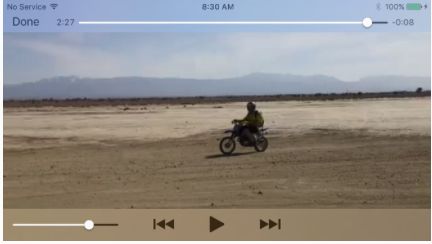

#Video视频
-
AVFoundation framework提供视频播放服务，我们可以用AVPlayer来进行视频播放（```import AVFoundation```）。AVPlayer不是一个view，它的视图是AVPlayerLayer，CALayer的子类，AVPlayerLayer可以直接添加到视图中。

iOS8引入的AVPlayerViewController就是封装好的用来播放视频的类，你只需要提供一个AVPlayer，AVPlayerViewController就会自动处理好播放界面，播放控制等功能。AVPlayerViewController是AVKit framework下的类（```import AVKit```）

```Swift
import UIKit
import AVKit
import AVFoundation

class ViewController: UIViewController {
    
    override func viewWillAppear(_ animated: Bool) {
        super.viewWillAppear(animated)
        try? AVAudioSession.sharedInstance().setCategory(AVAudioSessionCategoryPlayback)
        try? AVAudioSession.sharedInstance().setActive(true)
        
        // sheesh
        self.navigationController?.hidesBarsOnSwipe = true
        self.navigationController?.barHideOnTapGestureRecognizer.isEnabled = false
    }


    let which = 2
    
    @IBAction func doPresent(_ sender: Any) {
        switch which {
        case 1:
            let av = AVPlayerViewController()
            let url = Bundle.main.url(forResource:"ElMirage", withExtension: "mp4")!
            // let url = Bundle.main.url(forResource:"wilhelm", withExtension: "aiff")!
            let player = AVPlayer(url: url)
            av.player = player
            self.present(av, animated: true) {
                // av.view.backgroundColor = .green
            }
//            let iv = UIImageView(image:UIImage(named:"smiley")!)
//            av.contentOverlayView!.addSubview(iv)
//            let v = iv.superview!
//            iv.translatesAutoresizingMaskIntoConstraints = false
//            NSLayoutConstraint.activate([
//                iv.bottomAnchor.constraint(equalTo:v.bottomAnchor),
//                iv.topAnchor.constraint(equalTo:v.topAnchor),
//                iv.leadingAnchor.constraint(equalTo:v.leadingAnchor),
//                iv.trailingAnchor.constraint(equalTo:v.trailingAnchor),
//                ])

            av.delegate = self
            av.allowsPictureInPicturePlayback = true
            av.updatesNowPlayingInfoCenter = true // what does this do?
        case 2:
            // hmmm... this works so poorly that I can't really recommend it
            // if edgesForExtendedLayout is not set, we see the position slider just peeping down;
            // if it is, we don't see it at all, and so important functionality is lost
            // moreover, no matter what I do, the resulting interface is very confusing for the user
            // so I'm going to cut discussion of this approach from the book
            let av = AVPlayerViewController()
            av.edgesForExtendedLayout = []
            self.navigationController?.navigationBar.isTranslucent = false
            let url = Bundle.main.url(forResource:"ElMirage", withExtension: "mp4")!
            // let url = Bundle.main.url(forResource:"wilhelm", withExtension: "aiff")!
            let player = AVPlayer(url: url)
            av.player = player
            av.view.backgroundColor = .green
            self.show(av, sender: self)
        default: break
        }
        
    }
}

extension ViewController : AVPlayerViewControllerDelegate {
    
//    func playerViewControllerShouldAutomaticallyDismissAtPictureInPictureStart(_ playerViewController: AVPlayerViewController) -> Bool {
//        return false
//    }
    
    
    func playerViewController(_ pvc: AVPlayerViewController, restoreUserInterfaceForPictureInPictureStopWithCompletionHandler ch: @escaping (Bool) -> Void) {
        self.present(pvc, animated:true) { 
            ch(true)
        }
    }

}
```

如果你还想对视频进行简单的剪切，系统提供的UIVideoEditorController能满足你的需求。


+ AVPlayerViewController
  
  AVPlayerViewController是一个ViewController，使用它之前你唯一需要做的是传给它一个AVPlayer实例。AVPlayer可以通过init（url:）方法简单的实例化。然后把AVPlayerViewController加入到你的视图层级中就可以了。
  
  ```Swift
  let av = AVPlayerViewController()
let url = Bundle.main.url(forResource:"ElMirage", withExtension: "mp4")!
let player = AVPlayer(url: url)
av.player = player
self.present(av, animated: true)
  ```
  下面是实际效果图。
  <p align="center"></p> 
	+  AVPlayerViewController其他属性
		+ player
		+ showsPlaybackControls
		+ contentOverlayView
		+ videoGravity
		+ videoBounds
		+ isReadyForDisplay  	
	+ Picture-in-Picture
	
		iOS9之后支持多任务的iPad可以支持“画中画”功能
+ Introducing AV Foundation
	+ Some AV Foundation Classess
		+ AVURLAsset
		+ AVComposition
		+  
	+ Things Take Time
	+ Time is Measured oddly
	+ Constructing Media
	+ Synchronizing Animation with Video
	+ AVPlayerLayer
	+ Further Exploration of AV Foundation
		+ Extract single Images from a movie(AVAssetImageGenerator)
		+ Export a movie in a different format(AVAssetExportSession), or read/write raw uncompressed data through a buffer to or from a track
		+ Capture audio,video,and stills through the device's hardware
		+ Tap into video and audio being captured or played,including capturing video frames as still images 		
+ UIVideoEditorController
